  

  

  

# 🚀 About Me

I am a full-stack developer with a degree in Software Development from the **Universidad del Valle (Colombia)**. I am passionate about building robust architectures and highly scalable technology solutions.

I have experience in backend design, REST API development, and creating modern user interfaces. I specialize in microservices, design patterns, and hexagonal architecture, and have contributed to projects in the e-commerce, telemedicine, and business management systems sectors.

I am eager to constantly learn new technologies so I can continue to innovate and refine the software I develop every day.

> *"If you can imagine it, you can program it"*  — someone, though I've already forgotten who. 

  

## 🎓 Education

🏛 **Universidad del Valle** 

Technology in Software Development
and next year I will start my **Systems Engineering** degree.

Expected Graduation: **2026**

Relevant Areas

 

  

# 💻 Tech Stack

  

  

  

  

  

# 🏗 Software Architecture

I enjoy designing scalable systems using modern architectures.

  

# 🚀 Featured Projects

## 🛒 Univalle Shop
**Microservices E-commerce platform built with NestJS**

<table>
<tr>
<td width="70%">

**Technologies**

**Features**
- 🔐 Authentication
- 📦 Products Catalog
- 🛍️ Orders Management
- 🛒 Shopping Cart
- 🤖 Recommendations Engine
- 🏗️ 8 Microservices Architecture

</td>
<td width="30%" align="center">

[View Project](https://github.com/skratfall/Univalle-Shop)

</td>
</tr>
</table>

  

## 🏋 AgendaGym
**Native Android application for gym appointment management**

<table>
<tr>
<td width="70%">

**Technologies**

**Features**
- 🔐 Authentication
- 📲 Push Notifications
- ⚡ Real Time Database
- 🏛️ Clean Architecture

</td>
<td width="30%" align="center">

 
    

[View Project](https://github.com/skratfall/AgendaGym)

</td>
</tr>
</table>

  

## 🩺 MedConnect
**Telemedicine platform**

<table>
<tr>
<td width="70%">

**Technologies**

**Features**
- 🏥 Medical Appointments
- 🔐 Authentication
- 📞 Video Calls
- 📋 Medical History

</td>
<td width="30%" align="center">

  

[View Project](https://github.com/skratfall/medconnect)

</td>
</tr>
</table>

  

## 📊 Academic Dashboard
**Dashboard for academic performance**

<table>
<tr>
<td width="70%">

**Technologies**

**Features**
- 📐 GPA Calculator
- 📈 Final Grade Calculator
- 📊 Interactive Charts
- 📉 Statistics & Analytics

</td>
<td width="30%" align="center">

  

[View Project](https://github.com/skratfall/dashboard_academico)

</td>
</tr>
</table>

  

# 📈 GitHub Statistics

  
  

  

  

  

  

<picture>
  <source media="(prefers-color-scheme: dark)" srcset="https://raw.githubusercontent.com/skratfall/skratfall/output/galaga-contribution-graph-dark.svg">
  <source media="(prefers-color-scheme: light)" srcset="https://raw.githubusercontent.com/skratfall/skratfall/output/galaga-contribution-graph.svg">
  
</picture>

  

# 🌱 Currently Learning

- Kubernetes

- RabbitMQ

- Redis

- CI/CD

- Azure

- AWS

- Event Driven Architecture

- Distributed Systems

---

# 💡 Soft Skills

✔ Teamwork

✔ Leadership

✔ Communication

✔ Problem Solving

✔ Critical Thinking

✔ Adaptability

---

# 🎯 Interests

Backend Development

Cloud Computing

Software Architecture

Mobile Development

Artificial Intelligence

Open Source

---

# 📚 Certifications (Future)

- AWS Cloud Practitioner

- Docker Certified Associate

- Microsoft Azure Fundamentals

- Oracle Java

---

# 🌎 Languages

🇪🇸 Spanish — Native

🇺🇸 English — Intermediate (Improving every day)

---

# 📫 Contact

  

# ⚡ Fun Facts

☕ Coffee + Music = Productivity

📚 Always learning something new.

💻 Passionate about Software Architecture.

🚀 Love building scalable applications.

---

<h3 align="center">

"Programs must be written for people to read, and only incidentally for machines to execute."

— Harold Abelson

</h3>

  

